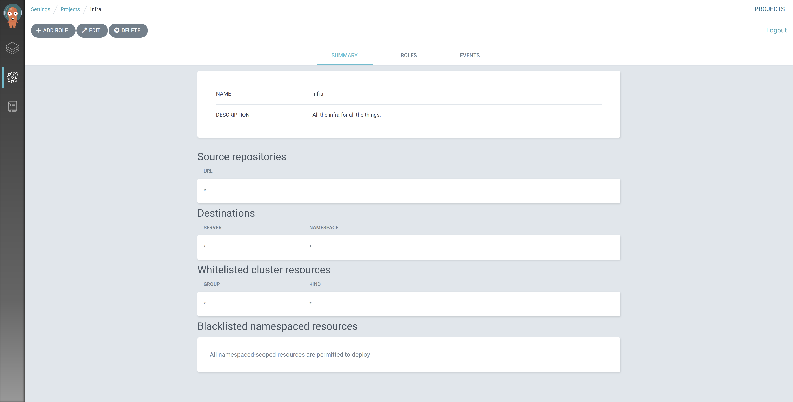
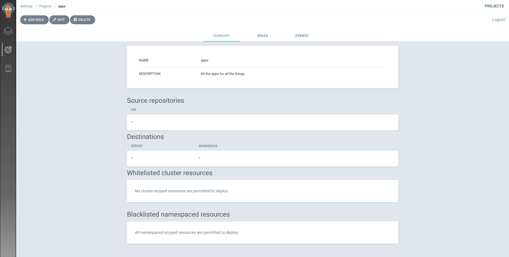
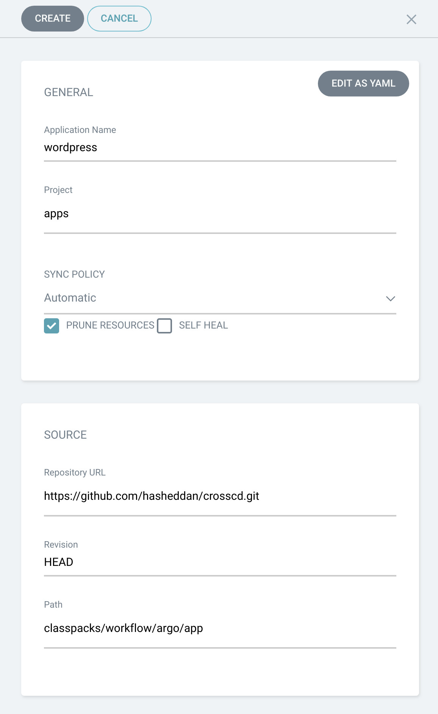
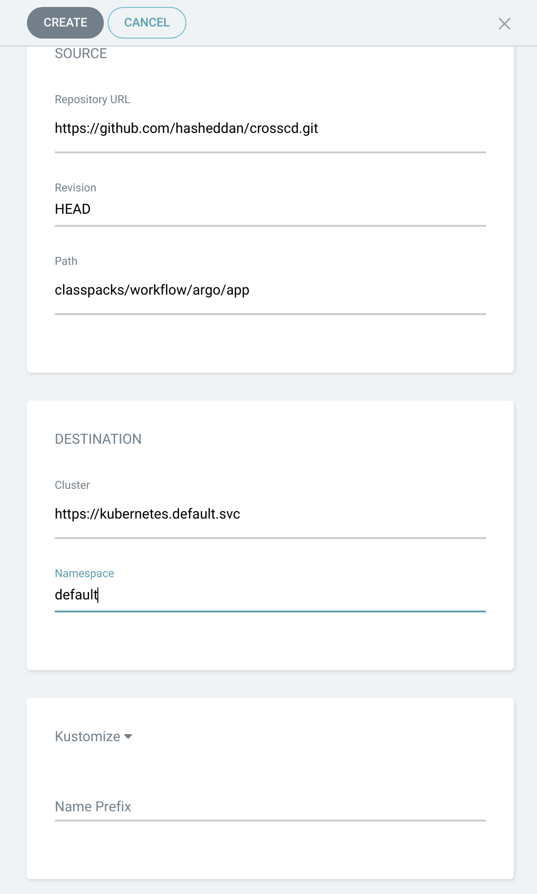
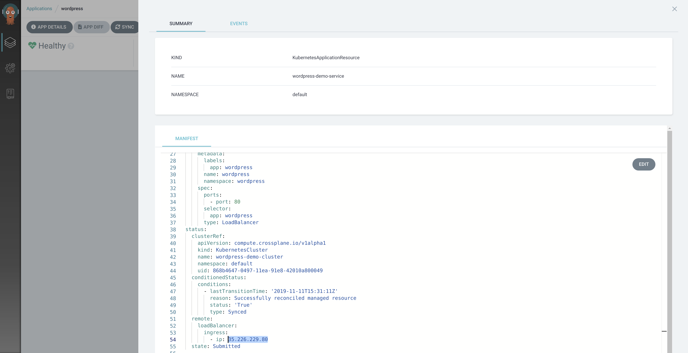
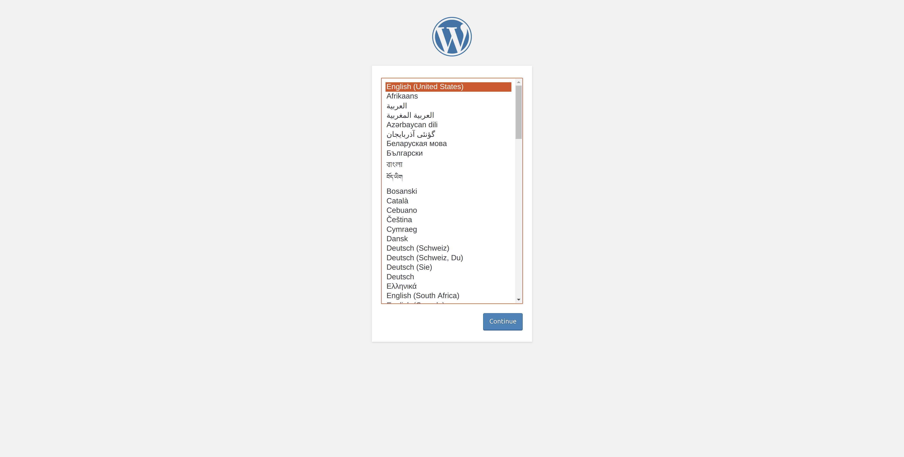

# Continuous Delivery with ArgoCD

[ArgoCD] is a continuous delivery tool for Kubernetes. It runs in a Kubernetes
cluster and enables a GitOps workflow by watching repositories and automatically
updating deployments using Kubernetes manifests. In this guide we will walk
through setting up ArgoCD, installing Crossplane and a few cloud provider
stacks, setting up an infrastructure pipeline, then finally deploying an
application that consumes cloud provider resources.

## Table of Contents

1. [Pre-requisites](#pre-requisites)
1. [Preparation](#preparation)
1. [Set Up ArgoCD](#set-up-argocd)
1. [Install Crossplane Components](#install-crossplane-components)
1. [Set Up an Infrastructure Pipeline](#set-up-an-infrastructure-pipeline)
    1. [Create an Infrastructure
       Repository](#create-an-infrastructure-repository)
    1. [Create an ArgoCD Project for
       Infrastructure](#create-an-argocd-project-for-infrastructure)
    1. [Configure Dev and Prod
       Environments](#configure-dev-and-prod-environments)
1. [Set Up an Application Pipeline](#set-up-an-application-pipeline)
    1. [Create an Application Repository](#create-an-application-repository)
    1. [Create an ArgoCD Project for
       Applications](#create-an-argocd-project-for-applications)
    1. [Configure an ArgoCD Application](#configure-an-argocd-application)
    1. [Deploy](#deploy)
1. [Customizing](#customizing)
1. [Clean Up](#clean-up)
1. [Next Steps](#next-steps)

## Pre-requisites

This guide assumes the presence of:

* An existing Kubernetes cluster
* [kubectl] configured to access the cluster

## Preparation

Before we get started deploying infrastructure and application components, we
need to set up ArgoCD and Crossplane in our existing Kubernetes cluster.

### Set Up ArgoCD

ArgoCD has a great [getting started] guide that walks through installing the
platform into your Kubernetes cluster. We will only need to complete steps 1-3
for this guide as we will be deploying all Crossplane components to the same
cluster that is running ArgoCD.

*Note: ArgoCD uses self-signed certificates, and it may be necessary to [enable
insecure connections] on localhost to utilize port-forwarding.*

### Install Crossplane Components

For this guide we will assume that an organization wants to enable provisioning
of managed service on [GCP] and [AWS]. To install Crossplane along with the GCP
and AWS, please see the [installation guide].

## Set Up an Infrastructure Pipeline

Now that ArgoCD and all Crossplane components are installed, it is time to build
out our infrastructure environments. 

### Create an Infrastructure Repository

ArgoCD is compatible with any hosted git platform. For this guide, we will use
Github, but you can choose whatever platform with which you are most
comfortable. For reference, we will be using [this repository] throughout the
following steps. Because it is a public repository, you are welcome to also use
it, but be aware that if you enable automatic deployment in the next steps on
pushes to `MASTER`, new resources may be deployed into your environment.

### Create an ArgoCD Project for Infrastructure

The two primary organizational units in ArgoCD are [projects] and
[applications]. For simplicity, a project can just be thought of a grouping of
applications that adhere to the same policies. In this guide, we are going to
create an `infra` project and and `apps` project because we want infrastructure
administrators to have very different permission levels than those of
application owners.

To create a new project, go to `Settings > Projects > New Project` in the ArgoCD
admin console. You may configure your project however you see fit, but it may be
easiest to give the most permissive access for this example and narrow the scope
if you intend to run in a long-term production scenario. Importantly, you must
at least whitelist all Crossplane providers, managed resources, and resource
classes that you intend to use as they are all cluster-scoped. In addition, you
must at least enable `in-cluster` as a destination. An example of the most
permissive project would look as follows: 



### Configure Dev and Prod Environments

Before we create ArgoCD projects for our infrastructure environments, we need to
consider how we are going to manage our `Provider` secrets in our cluster.
ArgoCD offers a variety of [secrets management integrations], but we will create
our secrets directly in our cluster for this guide. To set up your secrets and
your `Provider` objects, follow the steps in the [GCP provider], [AWS provider],
and [Azure provider] configuration guides. If you are not planning on deploying
resources on any of the three platforms, you are welcome to skip the setup of a
`Provider` for its stack.

Now we need to set up `dev` and `prod` environment resources for GCP in our
`infra` project. To do so, go to `Applications > New Application` and configure
as shown below or as appropriate with your repository:


After creating the application, you should see healthy status and a
visualization of all resources that were created:


You will notice that resource classes have both a `dev` and `prod` version
created, while the network resources (i.e. `Network`, `Subnetwork`,
`GlobalAddress`, `Connection`) have only one version and it is a managed
resource. These resources do not support dynamic provisioning and do not have
tiers appropriate for only development or only production. Therefore, they are
being statically provisioned and can be referenced by either the `dev` or `prod`
versions of the resource classes created.

If you would like to enable provisioning resources on AWS as well, follow the
same steps to set up an ArgoCD application that is pointed at the [AWS
infrastructure directory].

## Set Up an Application Pipeline

Now that we have classes provisioned for configuring external resources, we can
create pipelines to deploy applications that utilize those cloud services. 

### Create an Application Repository

Either choose an existing application repository or create a new one. The
repository should include claims that can be resolved by the environment classes
we created. If you want to use an example application, you can use Wordpress in
[this repository].

### Create an ArgoCD Project for Applications

Similar to the `infra` project above, create an ArgoCD project to contain
applications that will make use of our infrastructure. All of the resources that
we deploy in this project should be namespace-scoped, so there is no need to
whitelist any cluster-scoped resources. An example of an `apps` project with the
required permissions would look as follows:



### Configure an ArgoCD Application

Now to deploy the application, create a new application in the `apps` project.
It is important to pay special attention to the namespace because our
application resources will be namespace-scoped. Configure your application to
looks as follows or as needed for your application:





After creation of the application, you should see all resources appear in the
visualization. You can click on the `Service` resource to get the external IP
address of the Wordpress application when it becomes available.



If you navigate to the IP address, you should see the Wordpress start page.



## Customizing

We have successfully deployed Wordpress on GCP with `dev` tier infrastructure.
However, it may be desireable to provision on `prod` tier infrastructure, or
even a different cloud provider. Assuming you also set up AWS infrastructure
configuration in the [infrastructure](#configure-dev-and-prod-environments)
section above, this can be accomplished with simple changes to the Wordpress
deployment configuration. The resource claims use label selectors to be
scheduled to a certain class. If you take a look at [the patch in our
application configuration][app-patch], you will notice the following stanza:

```yaml
 classSelector:
    matchLabels:
      env: dev
      provider: gcp
```

Simply changing these labels to `env: prod` or `provider: aws` will cause the
resources to be provisioned on production tier infrastructure or on AWS instead
of GCP! Furthermore, if you would like more granular options for deploying
infrastructure, you can customize the labels on the resource classes that were
created to include any other distinguishing traits.

## Clean Up

To clean up all of our application components, you can simply delete each
application and those resources will be removed from your cluster.

## Next Steps

<!-- Named links -->
[ArgoCD]: https://argoproj.github.io/argo-cd/
[kubectl]: https://kubernetes.io/docs/tasks/tools/install-kubectl/
[getting started]: https://argoproj.github.io/argo-cd/getting_started/
[enable insecure connections]: https://stackoverflow.com/questions/7580508/getting-chrome-to-accept-self-signed-localhost-certificate
[installation guide]: install-crossplane.md
[GCP]: https://cloud.google.com/
[AWS]: https://aws.amazon.com/

[projects]: https://argoproj.github.io/argo-cd/operator-manual/declarative-setup/#projects
[applications]: https://argoproj.github.io/argo-cd/operator-manual/declarative-setup/#applications
[secrets management integrations]: https://argoproj.github.io/argo-cd/operator-manual/secret-management/
[GCP provider]: cloud-providers/gcp/gcp-provider.md
[AWS provider]: cloud-providers/aws/aws-provider.md
[this repository]: https://github.com/hasheddan/crosscd/tree/master/classpacks/workflow/argo
[app-patch]: https://github.com/hasheddan/crosscd/blob/master/classpacks/workflow/argo/app/patch.yaml
[AWS infrastructure directory]: https://github.com/hasheddan/crosscd/tree/master/classpacks/workflow/argo/infra/aws